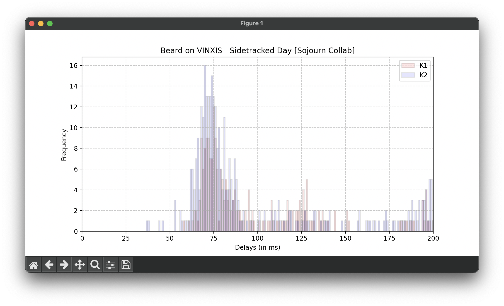

# osu! Keypress Analyzer



A simple tool that allows users to analyze any and all of a player's top 100 leaderboard scores, along with .osr replay files.

## Disclaimer

On June 15, 2024, a post was made to r/OsuReport with "evidence" that top player chud son/cloutiful was using some sort of relax/tapping hack. The post analyzed the keypress durations of many of chud son's replays, and found an anomaly that an overwhelming majority of his keypresses were held for exactly 63ms. It turns out that this analysis was correct, and chud son had been tampering with Wootility settings to give himself an unfair advantage.

In the aftermath of this post, many users (myself included, to an extent) have attempted to analyze other players' keypress durations in an attempt to find and ban players using a similar exploit.

**WARNING:** Despite the name, this tool does **NOT** perform analysis. This tool simply provides a more digestible interpretation of a replay file, and it is up to you, the user, to come up with analysis. **If you do not know what suspicious traits you're looking for in these graphs, take the results of this program with a grain of salt.**

## Prerequisites

- Python
    - matplotlib
        - `pip install matplotlib`
    - requests
        - `pip install requests`
    - dotenv
        - `pip install dotenv`

**NOTE:** I've only tested this program on UNIX-based systems. I'm not sure how things will go on Windows. If worst comes to worst, use WSL.

Additionally, if you plan to analyze replays given a user ID (as opposed to with .osr files), you will need both an osu! v1 API key, as well as a osu! v2 API client ID and client secret.

You can get these keys by visiting https://osu.ppy.sh/p/api. (I can't test it myself since I've had both API keys for some time, but it should be intuitive enough to understand. If not, naybe you shouldn't be using this tool...)


## "Installation"

Either clone the repositotry:

```sh
git clone https://github.com/clarks03/osu-keypress-analyzer.git
```

Or download the ZIP of the code from the website, and extract it.

### API Keys

If you would like to use API keys, then do the following:

1. Create a file called `.env` in the same (root) directory as all the other files in the repository.
2. Add the following contents to this file:

```
API_KEY=<key goes here>
CLIENT_ID=<id goes here>
CLIENT_SECRET=<secret goes here>
```

## Usage

There are two main ways to use this application, the first of which being the "user ID mode" and the second of which being the "manual replay file mode"

### User ID Mode

Run the main Python file as follows:

```python3 main.py```

With no extra arguments.

You will be prompted to enter a user ID; this value represents the digits after the `users/` in your osu! profile URL.

For example, when on my osu! profile, the URL is `osu.ppy.sh/users/9502512`, so my user ID would be `9502512`.

Afterwards, you will be prompted to select a replay to analyze. You can choose to analyze a single replay at a time (by entering a numerical index corresponding to the replay you want to analyze), or analyze all of a user's top 100 replays at once (by entering an asterisk "*").

**Note:** Getting an osu! replay given a replay ID is quite a taxing API request, and so it is limited to 10 requests per minute. As such, analyzing all of a user's replays at once can take up to 10 minutes. If you're in a hurry, it might be more worthwhile to either analyze a replay individually, or manually download a user's replays and analyze them all at once using the manual replay file mode.

### Manual Replay File mode

Run the Python file as follows:

```python3 main.py replay1.osr replay2.osr ...```

By stringing together all replays you want to analyze at once, space separated, after `main.py`.

For example, if I want to analyze 3 replays, named `replay1.osr`, `replay2.osr`, and `replay3.osr`, in the same directory as `main.oy`, I would write the following command:

```python3 main.py replay1.osr replay2.osr replay3.osr```

This produces a graph with all keypresses from all three replays in the same graph. If you'd rather analyze them individually, run the `main.py` command 3 times, each of which with only replay at a time.

This method does **not** require an API key to run, and is significantly faster than the User ID mode.

## Customization

If you don't mind delving into the source code of this project (which should be easy to understand, despite some ugly programming), there are some tweaks you can do to better analyze the replays.

### Changing the x-axis limit

Currently, the x-axis cuts off at 200ms. I found that, on average, more plays had keypresses between 100-200ms than plays strictly less than 100ms. However, some tools only display x-axes limited to 100ms.

To change this, look for the `RANGE` variable in `main.py` (which is currently set to `200`), and change it to whatever you wish. 

Do note that the higher the x-axis range, the smaller the bars in the bar graph.
